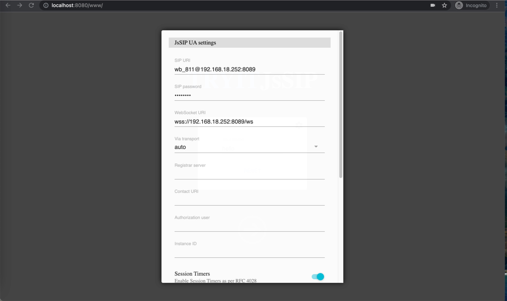

# JSSIP_DMEO_ZYCOO

演示如何使用 jssip 注册到 zycoo pbx.

## 运行

1. go build
2. ./jssip_demo_zycoo
3. [http://localhost:8080/www/](http://localhost:8080/www/).
配置账号

wss 连接失败需要访问 <https://x.x.x.x:8089> 加载证书

## 注意事项

1. front 编译 node 版本不能太高。
